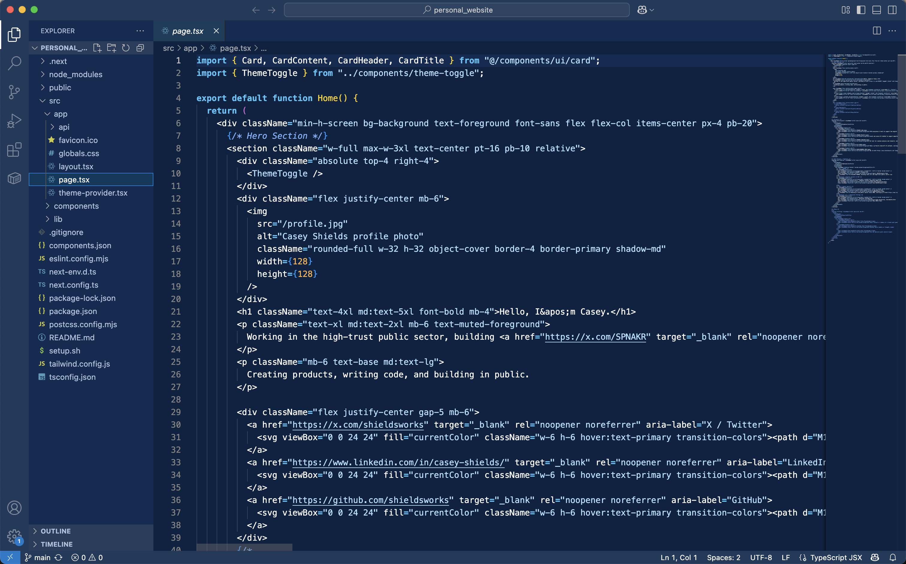

# Blueprint Theme for VS Code

A VS Code theme inspired by architectural blueprints—deep blues and crisp white text for a clean, high-contrast coding experience.

## Preview



## Installation

### Method 1: VS Code Marketplace (Recommended)

1. Open VS Code
2. Go to the Extensions view:
   - Press `Ctrl+Shift+X` (Windows/Linux) or `Cmd+Shift+X` (Mac)
   - Or click the Extensions icon in the Activity Bar
3. Search for "Blueprint Theme"
4. Click Install
5. Press `Cmd+K Cmd+T` (Mac) or `Ctrl+K Ctrl+T` (Windows/Linux)
6. Select "Blueprint" from the theme dropdown

### Method 2: Manual Installation

1. Clone this repository:

   ```bash
   git clone https://github.com/shieldsworks/blueprint-theme.git
   cd vscode-blueprint-theme
   ```

2. Install dependencies and package the theme:

   ```bash
   npm install -g @vscode/vsce
   vsce package
   ```

3. Install the generated .vsix file:

   - Using VS Code:
     - Press `Ctrl+Shift+P` (Windows/Linux) or `Cmd+Shift+P` (Mac)
     - Type "Install from VSIX"
     - Select the generated `.vsix` file
   - Or using command line:
     ```bash
     code --install-extension blueprint-theme-0.0.1.vsix
     ```

4. After installation:
   - Press `Cmd+K Cmd+T` (Mac) or `Ctrl+K Ctrl+T` (Windows/Linux)
   - Select "Blueprint" from the theme dropdown
   - If you don't see the theme, try:
     - Press `Cmd+Shift+P` (Mac) or `Ctrl+Shift+P` (Windows/Linux)
     - Type "Developer: Reload Window" and press Enter
     - Try selecting the theme again

### Method 3: Direct Use in Settings

1. Open your VS Code settings.json:

   - Press `Cmd+Shift+P` (Mac) or `Ctrl+Shift+P` (Windows/Linux)
   - Type "Preferences: Open Settings (JSON)"

2. Add these color customizations (example):
   ```json
   {
     "workbench.colorCustomizations": {
       "editor.background": "#0A2342",
       "editor.foreground": "#FFFFFF",
       "activityBar.background": "#102C54",
       "sideBar.background": "#0A2342",
       "sideBar.foreground": "#B0C4DE",
       "titleBar.activeBackground": "#1E3A5C",
       "statusBar.background": "#1E3A5C",
       "statusBar.foreground": "#FFFFFF",
       "tab.activeBackground": "#163D5C",
       "tab.inactiveBackground": "#0A2342",
       "editorGroupHeader.tabsBackground": "#102C54",
       "input.background": "#163D5C",
       "dropdown.background": "#163D5C",
       "panel.background": "#0A2342",
       "badge.background": "#1E3A5C",
       "badge.foreground": "#FFFFFF",
       "button.background": "#1E3A5C",
       "button.foreground": "#FFFFFF"
     },
     "editor.tokenColorCustomizations": {
       "comments": "#B0C4DE"
     }
   }
   ```

## Features

- Blueprint-inspired blue color palette
- High-contrast white text for readability
- Consistent UI elements and semantic highlighting
- Support for popular programming languages

## Color Palette

- Primary Blue: #0A2342
- Accent Blue: #1E3A5C
- Foreground: #FFFFFF
- Sidebar: #102C54
- Comments: #B0C4DE

## Contributing

1. Fork the repository
2. Create your feature branch (`git checkout -b feature/amazing-feature`)
3. Commit your changes (`git commit -m 'Add some amazing feature'`)
4. Push to the branch (`git push origin feature/amazing-feature`)
5. Open a Pull Request

## License

This project is licensed under the MIT License - see the LICENSE file for details.

## Acknowledgments

- Inspired by architectural blueprints and clean, modern design
- Created with ❤️ for the developer community
